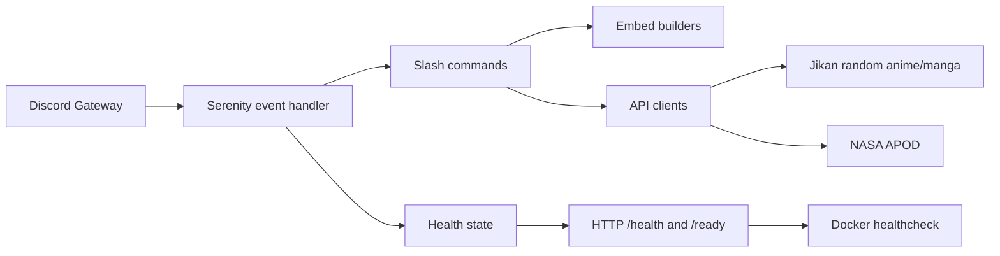

# Seris

A calm and precise Discord bot written in **Rust**, built with **serenity**.

Seris speaks softly, but executes with certainty. Designed to be minimal, reliable, and efficient — nothing more than what is needed.

---

## 🌙 Philosophy

> *Silence over noise. Clarity over excess.*

Seris is not flashy. She focuses on correctness, stability, and clean execution. Every feature exists for a reason.

---

## ✨ Features

* Slash commands (Discord Interactions)
* Clean permission boundaries
* Predictable behavior
* Minimal Docker footprint
* Fast startup, low memory usage

---

## 🧭 Commands

All commands are **slash commands** (`/`).

1. **Ping**
   `/ping` — Confirms responsiveness.

2. **Clear Messages**
   `/clear` — Removes messages (restricted permissions).

3. **NASA – Astronomy Picture of the Day**
   `/nasa apod` — Displays NASA’s daily image.

4. **Random Anime**
   `/anime random` — Suggests an anime title.

---

## ⚙️ Requirements

* Rust **1.83+**
* Discord Bot Token
* Optional: Docker

---

## 🔐 Configuration

Seris loads its settings from a TOML config file.

Default config file locations:

* Linux/macOS: `$XDG_CONFIG_HOME/seris/config.toml` when `XDG_CONFIG_HOME` is set
* Otherwise: `~/.config/seris/config.toml`
* Custom path: set `SERIS_CONFIG_FILE=/path/to/config.toml`

Example `config.toml`:

```toml
discord_token = "..."
nasa_api_key = "..."
```
* `discord_token`: Discord bot token
* `nasa_api_key`: Required for NASA commands

Seris reads application settings from TOML, with environment fallbacks for secrets. `SERIS_CONFIG_FILE` still overrides the config file path.

Build flags:

* `bot` - Discord bot functionality
* `cli` - admin CLI tools

Environment variable fallbacks are also supported for secrets:

* `SERIS_DISCORD_TOKEN`
* `SERIS_NASA_API_KEY`

Monitoring:

* `GET /health` on port `8080` returns `200` when the process is up.
* `GET /ready` returns `200` after Discord is connected and `503` otherwise.
* The Docker image includes a `HEALTHCHECK` against `/ready`.

---

## 🧱 Architecture



The bot keeps the command layer thin: commands call services, services fetch API data, and embeds format the response for Discord.

See also:

* `docs/architecture.md`
* `docs/api-endpoints.md`

---

## 🛟 Troubleshooting

* If the bot exits immediately, confirm `discord_token` and `nasa_api_key` are set in the config file or environment.
* If `/ready` keeps returning `503`, the Discord client has not connected yet or lost its shard connection.
* If Docker reports an unhealthy container, confirm port `8080` is exposed and no other process is binding it.
* If CLI commands ask for `sudo`, that is expected for service and config operations that modify system paths.

---

## 🚀 Deployment

Platform-specific deployment notes live in `docs/deployment.md`.

## ▶️ Running Locally

```bash
cargo run --release
```

## 🧰 Admin CLI

The installed `seris` binary also provides a small Linux admin CLI.

Examples:

```bash
seris version
seris config path
seris config edit
seris service status
seris service restart
seris service logs --follow
seris self-update v1.0.1
```

Commands that touch the installed config file or the `systemd` service will prompt for `sudo` automatically when needed.

## 📦 GitHub Release Assets

When a GitHub Release is published, `.github/workflows/release-assets.yml` builds and uploads a raw Linux binary plus a bundled Linux installer.

Included assets:

* `seris-<tag>-x86_64-unknown-linux-gnu`
* `seris-<tag>-x86_64-unknown-linux-gnu.tar.gz`
* `install.sh`
* matching `.sha256` files

Bundle contents:

* `seris`
* `install-local.sh`
* `config.example.toml`
* `README.md`

## 🛠️ Automatic Installers

The Linux bootstrap installer downloads the Linux bundle, installs `seris` into `/opt/seris`, creates a `systemd` service, and enables it on boot.

```bash
curl -fsSL https://github.com/nathan2slime/seris/releases/download/<tag>/install.sh | sudo sh
```

Optional version override:

```bash
curl -fsSL https://github.com/nathan2slime/seris/releases/download/<tag>/install.sh | sudo sh -s -- <tag>
```

### Local bundle installers

If you prefer extracting a release bundle manually, run the bundled local installer instead:

* Linux: `sudo ./install-local.sh`

---

## 📚 API Endpoints

The external and internal endpoints used by Seris are documented in `docs/api-endpoints.md`.

---

## 🐳 Docker (Minimal Image)

Seris is built to run in **ultra-minimal containers**.

### Build

```bash
docker build -t seris .
```

### Run

```bash
docker run --env-file .env seris
```

* Image size: **~4–6 MB**
* Static binary
* No shell, no package manager
* Runs as non-root

---

## 🧼 Production Notes

* Uses `rustls` (no OpenSSL)
* Compatible with `scratch` or `distroless`
* Reduced attack surface
* Deterministic behavior

---

## 📜 License

MIT

---

> *Seris does not rush. She executes.*
