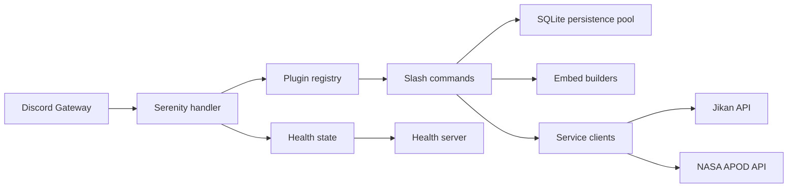

# Architecture

Seris follows a small, layered flow:

## Runtime pieces

* `src/main.rs` boots the bot, configures logging, and starts the health server.
* `src/utils.rs` maps Serenity events into readiness state and logs lifecycle changes.
* `src/plugins.rs` groups slash commands into internal plugins.
* `src/database.rs` stores persistent command usage in SQLite using a small connection pool.
* `src/benchmarks.rs` provides timing and memory sampling helpers for hot paths.
* `src/commands/` contains the slash command entry points.
* `src/services/` handles external API calls, retry/circuit behavior, and static URL caching for hot paths.
* `src/embeds/` turns service payloads into Discord messages.

## Request flow

1. Discord dispatches an interaction.
2. Serenity hands it to the event handler or slash command.
3. The plugin registry groups commands by capability.
4. Commands record usage in SQLite when appropriate.
5. Commands call a service client when data is needed.
6. The service client fetches or caches the payload.
7. An embed builder formats the response for Discord.
