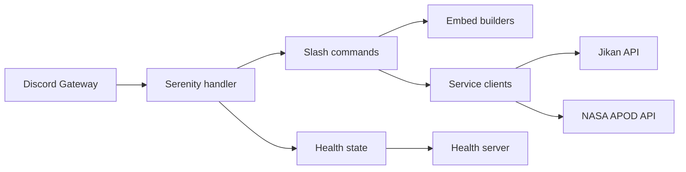

# Architecture

Seris follows a small, layered flow:

## Runtime pieces

* `src/main.rs` boots the bot, CLI, and health server.
* `src/utils.rs` maps Serenity events into readiness state.
* `src/commands/` contains the slash command entry points.
* `src/services/` handles external API calls and retry/circuit behavior.
* `src/embeds/` turns service payloads into Discord messages.

## Request flow

1. Discord dispatches an interaction.
2. Serenity hands it to the event handler or slash command.
3. Commands call a service client when data is needed.
4. The service client fetches or caches the payload.
5. An embed builder formats the response for Discord.
